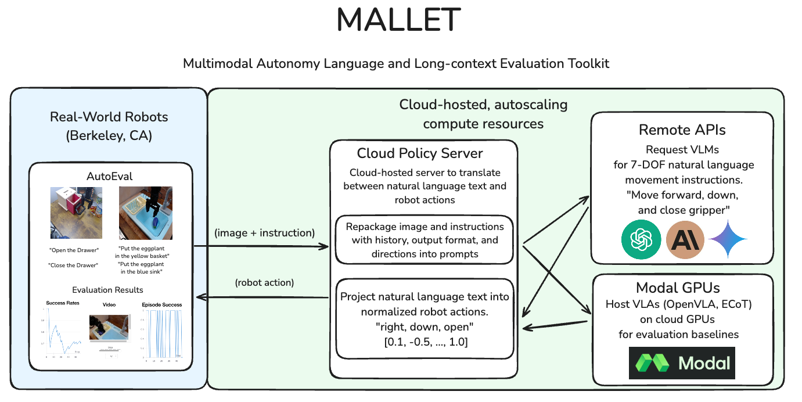
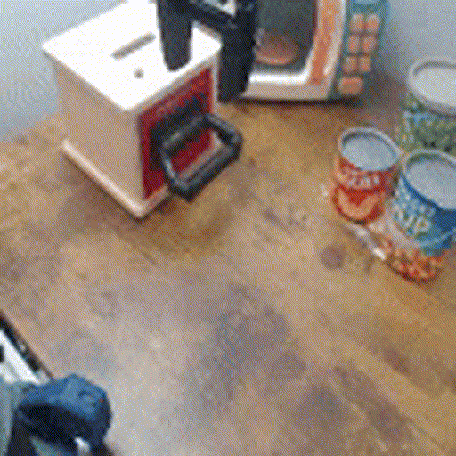
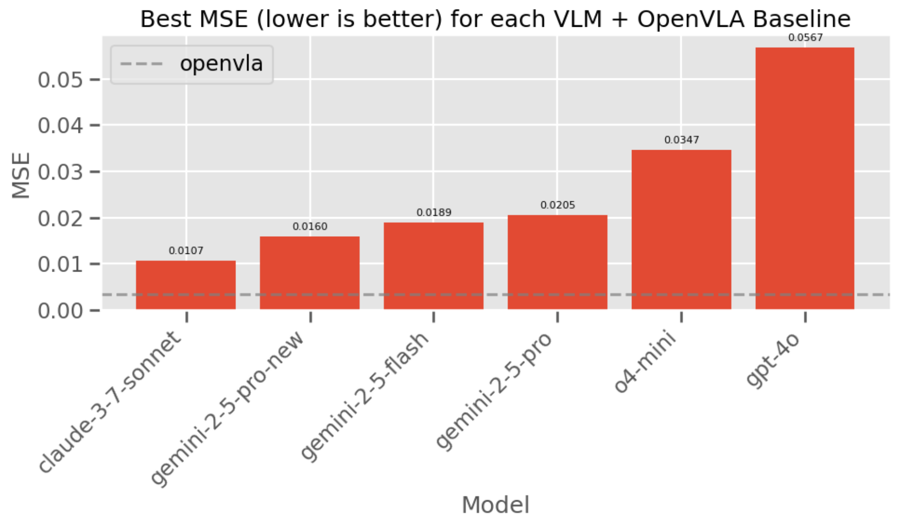
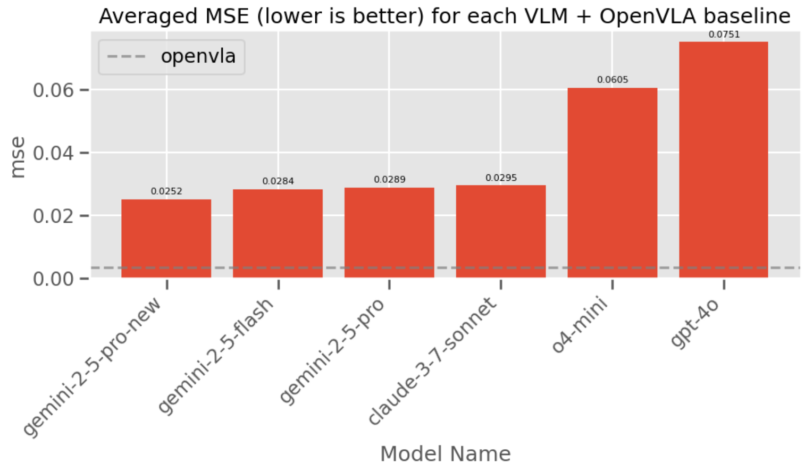
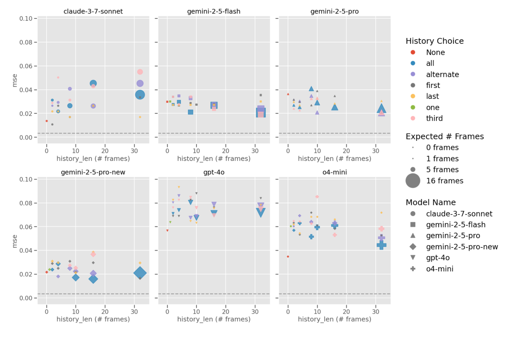
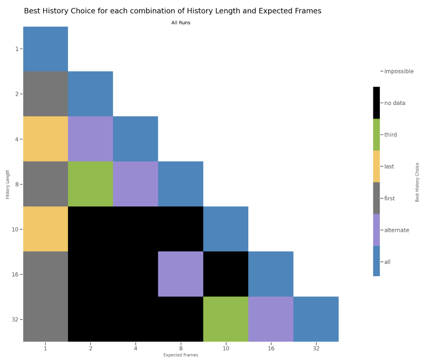

# MALLET: Multimodal Autonomy Language and Long-Context Evaluation Toolkit

[](https://www.python.org/downloads/)
[](https://opensource.org/licenses/Apache-2.0)
[](https://github.com/psf/black)

Created by [Jacob Phillips](https://jacobdphillips.com/)


<p align="center"><em>System diagram showing MALLET's architecture for controlling real-world robots using cloud-hosted VLMs</em></p>

MALLET (Multimodal Autonomy Language and Long-Context Evaluation Toolkit) is an open-source (Apache 2.0) toolkit for controlling real-world robots with cloud-hosted vision-language models (VLMs), as well as a suite of tools for evaluating the capabilities of VLMs in long-context multimodal settings. MALLET is built on top of [Paul Zhou's](https://github.com/zhouzypaul) [AutoEval](https://github.com/zhouzypaul/auto_eval) and [mse-check](https://github.com/zhouzypaul/mse-check), which allows us to submit action commands to real-world robots and evaluate offline policies.

MALLET provides a toolkit for researchers to conduct GPU-heavy real-world robotics research *without* having to purchase robots or GPUs! We build several capabilities for researchers to build and evaluate multimodal agents that can operate in the real world. We also provide code to run vision-language-action (VLA) models in the cloud.

MALLET makes two large contributions to the robotics community:
1. MALLET presents a framework on top of [Embodied Chain of Thought (ECoT)](https://github.com/MichalZawalski/embodied-CoT) for translating between natural language and continuous, 7 degree-of-freedom (DoF) robot actions, which enables VLMs to directly control real-world robots.
2. MALLET enables robot researchers to use cloud-based, autoscaling GPU compute frameworks like [Modal](https://modal.com/) to serve VLM or VLA-based policies instead of exposing their own computers.

We use MALLET to evaluate the performance of VLMs on controlling real-world robots in `AutoEval`. We also use MALLET with `mse-check` to evaluate the performance of VLMs in long-context multimodal settings, ablating prompts, history selection, and inference time-cost tradeoffs.

## Overview
- [Installation](#installation)
- [MALLET Toolkit](#mallet-toolkit)
    - [Language-to-Action Backtranslation](#language-to-action-backtranslation)
    - [VLM and VLA Servers](#vlm-and-vla-servers)
    - [Rate Limiting and Monitoring](#rate-limiting-and-monitoring)
- [Modal Servers](#modal-servers)
- [mse-check](#mse-check)
- [Evaluation](#evaluation)
- [Acknowledgements and Citation](#acknowledgements-and-citation)

## Installation
<details>
<summary>Click to expand</summary>
MALLET requires Python 3.10 or higher. We recommend using `uv` for fast and reliable dependency management.

1. Install `uv` if you haven't already:
```bash
curl -LsSf https://astral.sh/uv/install.sh | sh
```

2. Clone the repository and its submodules:
```bash
git clone --recursive https://github.com/jacobphillips99/mallet.git
cd mallet
```

3. Create and activate a virtual environment with Python 3.10:
```bash
uv venv .venv --python=python3.10
source .venv/bin/activate  # On Unix/macOS
# or
.venv\Scripts\activate  # On Windows
```

4. Install the package and its dependencies:
```bash
uv pip install -r requirements.txt
uv pip install -e .
```
</details>


## MALLET Toolkit
MALLET is a Python library that lets you control real-world robots using large Vision-Language Models (VLMs) and evaluate their performance. It provides a suite of tools for bridging natural language and continuous 7-DoF robot actions, built on the [Embodied Chain-of-Thought (ECoT)](https://github.com/MichalZawalski/embodied-CoT) paradigm. MALLET includes modules for language-to-action backtranslation, `AutoEval` compliant VLM and VLA servers, rate limiting and monitoring, and more. 

### Language-to-Action Backtranslation
The ECoT project develops a [set of primitives for translating robot actions into natural language](https://github.com/MichalZawalski/embodied-CoT/blob/main/scripts/generate_embodied_data/primitive_movements.py). The ECoT project goes on to develop synthetic, grounded chain-of-thought reasoning traces for model training. Instead, we are interested in the reverse direction: given a natural language description of an action, how can we translate it into a sequence of robot actions? We [invert the ECoT primitive movements](https://github.com/jacobphillips99/mallet/blob/main/src/mallet/utils/ecot_primitives/inverse_ecot_primitive_movements.py) to develop a language-to-action backtranslation framework for MALLET. We use VLMs to predict the direction, magnitude, and explanation for each degree of freedom in the robot's action space.

```bash
ECOT([0.7, -0.1, ..., 1.0]) --> "Move left, down, open gripper"

MALLET("""
Left 90% in order to align with the object,
Down 10% to grasp object,
Open Gripper 100% to prepare for grasp.
""") --> [0.7, -0.1, ..., 1.0]
```

In order to translate a direction and magnitude into a robot action, we first calculate the [action bounds](https://github.com/jacobphillips99/mallet/blob/main/src/mallet/utils/ecot_primitives/action_bounds.json) for the given robot. We select the action bounds based on the collected dataset, setting the bounds to the 10th and 90th percentiles of the data. We then scale the direction and magnitude to the appropriate range, and convert the normalized action into a robot action. This makes it easy for VLMs to predict actions that are sensible for the robot's action space. Additionally, we provide a set of prompts describing the robot, the methodology, the action space, the environment, and the output format. These components are extremely modular and enable simple integration with the rest of the MALLEt toolkit; all prompts and a special `PromptBuilder` class are availabe in [`mallet.models.translation.py`](https://github.com/jacobphillips99/mallet/blob/main/src/mallet/models/translation.py).

### VLM and VLA Servers

#### VLM Class
We present AutoEval-compliant VLM and VLA FastAPI servers that can be used to serve and evaluate multimodal and robot policies. The [core VLM class](https://github.com/jacobphillips99/mallet/blob/main/src/mallet/models/vlm.py) wraps `litellm` to provide a simple interface for calling any LLM. We build a [composable Pydantic-based framework](https://github.com/jacobphillips99/mallet/blob/main/src/mallet/models/vlm.py#L106) for building multimodal requests with a focus on extensibility and modularity. The VLM class can generate asynchronous responses, build prompts, [store historical requests and responses](https://github.com/jacobphillips99/mallet/blob/main/src/mallet/models/vlm.py#L106), and parse responses into a structured format. Here's a simple example of using the VLM class to build a multimodal request and return a robot action:

```python
import asyncio
from mallet.models import VLM, VLMInput, VLMRequest, parse_vlm_response
from mallet.utils.ecot_primitives.inverse_ecot_primitive_movements import text_to_move_vector

model = "gpt-4o-mini"

# create the VLM request
prompt_text = "Open the drawer"
image_bytes = ... # load image from disk or camera
vlm_input = VLMInput(prompt=prompt_text, images=[ImageInput(data=image_bytes)])
request = VLMRequest(vlm_input=vlm_input, model=model)

# instantiate the VLM class
vlm = VLM(model=model)
response = asyncio.run(vlm.generate(request))

# parse the response into a structured format
description, structured_answer = parse_vlm_response(response.text)

# convert the structured answer into a robot action
robot_action = text_to_move_vector(structured_answer)
```

#### Native FastAPI Servers
The [`mallet.servers.server.py`](https://github.com/jacobphillips99/mallet/blob/main/src/mallet/servers/server.py) module contains a generic FastAPI server we call the VLMPolicyServer. This server is a drop-in replacement for the AutoEval `PolicyServer` and can be used to serve any multimodal policy by wrapping a VLM object with a FastAPI endpoint and serving it with Uvicorn. This allows us to serve multimodal policies locally or in the cloud. The VLMPolicyServer also enables logging, history, and serves as an interface between the AutoEval and mse-check frameworks and MALLET. For example, the VLMPolicyServer exposes the `/act` endpoint, which is hit by the AutoEval server with a payload (including the image and instruction) and returns the 7-DoF robot action.

```python
from mallet.servers.server import VLMPolicyServer

server = VLMPolicyServer(model="gpt-4o-mini", history_length=10, history_choice="all")
server.run(host="0.0.0.0", port=8000)
```

or equivalently,

```bash
python src/mallet/servers/server.py --model gpt-4o-mini --history_length 10 --history_choice all
```

This spins up a FastAPI server on the localhost that can be hit with a payload of an image and instruction. Upon hitting the `/act` endpoint, the VLM object sends a remote API request to the model (in this case, `gpt-4o-mini`) and then translates the natural language into a continous robot action. The VLMPolicyServer also enables history, which can be used to record and use historical requests and responses. The server can be instructed to internally record and use historical inputs and outputs or to accept a `history_dict` parameter to use external history sent from the client. History is controlled via two parameters: `history_length` and `history_choice`. `history_length` controls how many steps of history to keep in the server's memory and must be a positive integer; we ablate over `[1, 2, 4, 8, 10, 16, 32]` steps. `history_choice` controls which steps of history to use for context in the prompt; we ablate over `[first, last, alternate, third, all]` strategies, which describe selecting the first, last, every other, every third, or all steps of history. When history length is set to 0, the history choice is `None`; when history length is set to 1, the history choice is `one` as all methods result in the same choice.

We also provide compatible forks of servers for OpenVLA (from [AutoEval](https://github.com/zhouzypaul/auto_eval/blob/main/auto_eval/policy_server/openvla_server.py) and [the original authors](https://github.com/openvla/openvla/blob/main/vla-scripts/deploy.py)) and [ECoT](https://colab.research.google.com/drive/1CzRKin3T9dl-4HYBVtuULrIskpVNHoAH?usp=sharing#scrollTo=owVajjweDopA).


### Rate Limiting and Monitoring
To safely scale and handle API usage, MALLET includes a real-time outbound request rate-limiter. Users can define per-provider and per-model limits (such as requests/min, tokens/min, and number of concurrent requests) to prevent unexpected rate-limiting by model providers. The [`rate_limits.yaml`](https://github.com/jacobphillips99/mallet/blob/main/src/mallet/config/rate_limits.yaml) contains the configuration for the rate limiter, which is loaded into the singular [`RateLimit`](https://github.com/jacobphillips99/mallet/blob/main/src/mallet/models/rate_limit.py)object. The RateLimit object is passed to each VLM object in order to limit the rate of outbound requests. The RateLimit object tracks usage statistics and even provides a CLI tool to view rate limit activity in real-time. See [rate_limit_cli.py](https://github.com/jacobphillips99/mallet/blob/main/src/mallet/models/rate_limit_cli.py) for the `curses` based UI tool showing each mode's request rate and token consumption live.

## Modal Servers

Modal is a compute orchestration platform that allows you to deploy python functions and FastAPI apps in the cloud. We use Modal to deploy AutoEval-compliant VLM and VLA servers that can be used to serve and evaluate multimodal and robot policies without the local compute resources to run them. We develop [CPU-based VLM servers](https://github.com/jacobphillips99/mallet/tree/main/modal_servers/vlm) and [GPU-based VLA servers](https://github.com/jacobphillips99/mallet/tree/main/modal_servers/vla) for MALLET.

For both server types, we also develop two options: either a typical, autoscaling Modal deployment that treats each function call as a new container, or a Modal `tunnel` deployment that creates a single server that opens a connection on a given port. The tunnel approach removes some latency and enables stateful servers that can be used to record and use historical requests and responses, but must be manually opened and closed. The tunnel approach also provides a port that can be specified in the URL, which is useful for testing and debugging.

Throughout this repo and `AutoEval`, we use the [sentinel value of `-1`](https://github.com/jacobphillips99/mse-check/blob/004001deed65049cefe09b7c62ee61f129c00072/utils/server.py#L22) to indicate that a server is deployed on a cloud-based service that obscures the underlying port and removes it from the URL.

#### VLM Modal Server
The VLM Modal server wraps the `VLMPolicyServer` in a Modal app, which gets deployed as a Modal ASGI (Asynchronous Server Gateway Interface) app. The Modal app is defined in [`modal_servers/vlm/vlm_modal_server.py`](https://github.com/jacobphillips99/mallet/blob/main/modal_servers/vlm/vlm_modal_server.py). At deployment-time, the Modal app is configured with the `model` parameter, which tells the `VLMPolicyServer` which remote model provider to use for API calls.

```bash
MODEL="gpt-4o-mini" modal deploy modal_servers/vlm/vlm_modal_server.py
```

To use the tunnel approach, we run the neighboring [`vlm_modal_server_with_tunnel.py`](https://github.com/jacobphillips99/mallet/blob/main/modal_servers/vlm/vlm_modal_server_with_tunnel.py) script, which deploys the app, opens a tunnel, and starts the server. This also enables the server to use history; this can be configured by setting the `HISTORY_LENGTH` and `HISTORY_CHOICE` environment variables. The logs will contain the instantiated host and port.

```bash
HISTORY_LENGTH=10 HISTORY_CHOICE="all" modal run modal_servers/vlm/vlm_modal_server_with_tunnel.py
```

#### VLA Modal Server
The VLA Modal server is a simple wrapper on top of the servers provided in the `mallet.servers` module. The [Modal app selects a GPU runtime](https://github.com/jacobphillips99/mallet/blob/main/modal_servers/vla/vla_modal_server.py), mounts the HuggingFace cache, and runs the server. Similarly to the VLM Modal servers, the VLA Modal server can be deployed with a tunnel to expose the port but must be manually spun up and down.

```bash
modal deploy modal_servers/vla/vla_modal_server.py
# or optionally with a tunnel to expose the port
modal run modal_servers/vla/vla_modal_server_with_tunnel.py
```

Note that GPU-based Modal servers have a longer spin-up time than CPU-based servers as they must download and cache model weights. It is reccomended to send a test request or to "warm" a pod before using the server in a performance-critical application such as `AutoEval`.

## mse-check
Paul Zhou's `mse-check` is lightweight dataset of robot trajectories that can be used to evaluate the performance of multimodal policies. The framework was originally designed as a simple check that policies for AutoEval are working as expected, but `mallet` extends it to testing general VLM performance across a variety of variables. We develop a testing framework that allows us to ablate prompt, history, and inference time-cost tradeoffs, and to test the performance of VLMs in long-context multimodal settings. We extend `mse-check` to support parallel, asynchronous policy evaluation, local or remote execution, and develop sophisticated tools for visualizing and analyzing policy performance, including a hyperparameter sweep tool. See the main test script at [`mse-check/test_policy_client_mse.py`](https://github.com/jacobphillips99/mallet/blob/main/mse-check/test_policy_client_mse.py), the sweep tool at [`mse-check/sweep_test.py`](https://github.com/jacobphillips99/mse-check/blob/main/sweep_test.py), or visualization notebook at [`mse-check/compare_models.ipynb`](https://github.com/jacobphillips99/mse-check/blob/main/compare_models.ipynb).

## Evaluation
Does this work? Unfortuantely, the answer right now is no. We are working on it! Below are a few examples of VLMs controlling real-world robots in the AutoEval framework.


<p align="center"><em>Demonstration of `gemini-2.5-flash-preview-04-17` attempting the task "Open the drawer" in an AutoEval evaluation cell.</em></p>


<p align="center"><em>Demonstration of `o4-mini` attempting the task "Close the drawer" in an AutoEval evaluation cell.</em></p>

In both cases, the VLM understands the task and is able to make a plan, but struggles with depth perception and perspective to successfully complete the task. Models that specialize in embodied reasoning, like [`Gemini Robotics ER`](https://storage.googleapis.com/deepmind-media/gemini-robotics/gemini_robotics_report.pdf) may perform better on these setups! Since we were unable to find a model that could make progress on these tasks, we use `mse-check` to evaluate the performance of VLMs in long-context multimodal settings.

Using the updated `mse-check` framework, we evaluate the impact of historical images and actions on the performance of VLMs to understand the inference-cost tradeoffs. We evaluate accumulating a history of images and actions over the last `[0, 1, 2, 4, 8, 10, 16, 32]` steps and subselecting from that history with `[first, last, alternate, third, all]` strategies. We evaluate the performance of a variety of providers and models, including OpenAI (`gpt-4o`, `gpt-4o-mini`, `o4-mini`), Anthropic (`claude-3-7-sonnet`, `claude-3-5-sonnet`), and Gemini (`gemini-2-5-pro`, `gemini-2-5-flash`). See the rate limit configuration at [`src/mallet/config/rate_limits.yaml`](https://github.com/jacobphillips99/mallet/blob/main/src/mallet/config/rate_limits.yaml) for the full list of providers and models, including specific dates for model releases. We ran a total of 170 experiments across models, history lengths, history choices, and repeats for statistical significance.



<p align="center"><em>Best overall mean-squared-error (MSE) results for each VLM + OpenVLA baseline.</em></p>

Interestingly, the overall best-performing model is `claude-3-7-sonnet`, despite ranking significantly lower than the other models on other multimodal benchmarks like [MMMU](https://mmmu-benchmark.github.io/#leaderboard).



<p align="center"><em>Averaged mean-squared-error (MSE) results for each VLM + OpenVLA baseline.</em></p>

However, when averaging across all experiments for a given model, `gemini-2-5-pro-new` (the version released 05/06/2025) performs better than all other models. Notably, the Gemini and Claude models perform significantly better than the OpenAI models.



<p align="center"><em>Facet chart showing the performance of each model across all history lengths and choices.</em></p>

We also present a representation of the performance of each model across all history lengths and choices. The face chart shows the performance of each experiment, with the axes synced across each chart. The x-axis measures `history_length`; the y-axis measures `mse`; the color of each dot represents the `history_choice` strategy; the size of each marker measures `expected_frames`, which represents the number of frames selected from the history according to the `history_choice` strategy (e.g., if `history_length=10` and `history_choice="alternating"`, then `expected_frames=5`). The dotted line represents the OpenVLA baseline with `history_length=0`.

Finally, we present a heatmap of the best performing history choice for each combination of `history_length` and `expected_frames`. The heatmap shows the best performing history choice for each combination of `history_length` and `expected_frames`, with the color representing the `history_choice` strategy.



<p align="center"><em>Heatmap of the best performing history choice for each combination of `history_length` and `expected_frames`.</em></p>

As expected, the best performing strategy is to include as much of the history as possible, as demonstrated by the blue `all` strategy winning along the main diagonal. As you reduce the frontier of available data, the roughly best performing strategy continues to be the strategy with the most information, stepping down through `alternating` and then `third`. Interestingly, when when the number of expected frames is 1, the best performing strategy is split between `first` and `last`, meaning that information is relevant from both ends of the history.

### Running the Evaluation
First, setup a policy server following the instructions above - this can be a local server or a remote server deployed with Modal. Note the host and port of the server. You can run evaluation over a single set of parameters with the following command:

```bash
python mse_check/test_policy_client_mse.py --host <host> --port <port> --model <model> --history_length <history_length> --history_choice <history_choice>
```

or run a sweep over a range of parameters with the following command:

```bash
python mse_check/sweep_test.py
```


## Acknowledgements and Citation
This project was developed by [Jacob Phillips](https://jacobdphillips.com) as a part of the [Andreessen Horowitz American Dynamism Engineering Fellows program](https://a16z.com/the-american-dynamism-engineering-fellows-program/). Special thanks to the American Dynamism team for their support and feedback on the project.

If using the MALLET toolkit in your work, please cite it to acknowledge the authors. Suggested format:

```bibtex
@software{MALLET,
    title = {MALLET: Multimodal Autonomy Language and Long-Context Evaluation Toolkit},
    author = {Jacob Phillips},
    url = {https://github.com/jacobphillips99/mallet},
    version = {insert version number},
    date = {insert date of usage},
    year = {2025},
}
